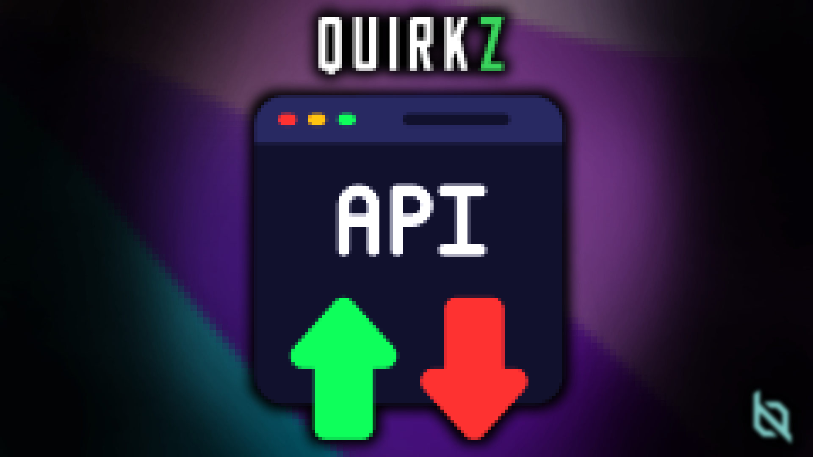

# QuirkZ: API

A collection of usefull tool mainly used for the other **QuirkZ** mods for [Project Zomboid](https://store.steampowered.com/app/108600/Project_Zomboid/). 

You may use this library to help you with your mod conception as it include lots of tools to simplify modding in Project Zomboid.

# Features

- Creation of custom page of keybind and options in the options menu.
- Creation of custom window used in game
- Managing the theme of windows in the game
- Custom action created for the game

# Usage

...

# Contributing

...